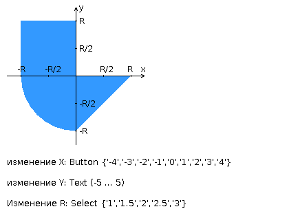

Лабораторная работа #1
Вариант
408549
Внимание! У разных вариантов разный текст задания!
Разработать FastCGI сервер на языке Java, определяющий попадание точки на координатной плоскости в заданную область, и создать HTML-страницу, которая формирует данные для отправки их на обработку этому серверу.

Параметр R и координаты точки должны передаваться серверу посредством HTTP-запроса. Сервер должен выполнять валидацию данных и возвращать HTML-страницу с таблицей, содержащей полученные параметры и результат вычислений - факт попадания или непопадания точки в область (допускается в ответе сервера возвращать json строку, вместо html-страницы). Предыдущие результаты должны сохраняться между запросами и отображаться в таблице.

Кроме того, ответ должен содержать данные о текущем времени и времени работы скрипта.

**Комментарии по выполнению ЛР:**
* Требуется поднять Apache httpd веб-сервер от лица своего пользователя на гелиосе (шаблон файла конфигурации доступен для скачивания наверху страницы)
* Веб-сервер должен заниматься обслуживанием статического контента (html, css, js) и перенаправлять запросы за динамическим контентом к FastCGI серверу
* FastCGI сервер требуется реализовать на языке Java (полезная библиотека в помощь в виде jar архива доступна для скачивания наверху страницы) и поднять также на гелиосе
* **Путем обращений из JavaScript к FastCGI серверу требуется показать понимание принципа AJAX**

**Разработанная HTML-страница должна удовлетворять следующим требованиям:**

* Для расположения текстовых и графических элементов необходимо использовать табличную верстку.
* Данные формы должны передаваться на обработку посредством POST-запроса.
* Таблицы стилей должны располагаться в отдельных файлах.
* При работе с CSS должно быть продемонстрировано использование селекторов псевдоклассов, селекторов классов, селекторов идентификаторов, селекторов дочерних элементов а также такие свойства стилей CSS, как наследование и каскадирование.
* HTML-страница должна иметь "шапку", содержащую ФИО студента, номер группы и новер варианта. При оформлении шапки необходимо явным образом задать шрифт (serif), его цвет и размер в каскадной таблице стилей.
* Отступы элементов ввода должны задаваться в процентах.
* Страница должна содержать сценарий на языке JavaScript, осуществляющий валидацию значений, вводимых пользователем в поля формы. Любые некорректные значения (например, буквы в координатах точки или отрицательный радиус) должны блокироваться.

**Вопросы к защите лабораторной работы:**

1. Протокол HTTP. Структура запросов и ответов, методы запросов, коды ответов сервера, заголовки запросов и ответов.
2. Язык разметки HTML. Особенности, основные теги и атрибуты тегов.
3. Структура HTML-страницы. Объектная модель документа (DOM).
4. HTML-формы. Задание метода HTTP-запроса. Правила размещения форм на страницах, виды полей ввода.
5. Каскадные таблицы стилей (CSS). Структура - правила, селекторы. Виды селекторов, особенности их применения. Приоритеты правил. Преимущества CSS перед непосредственным заданием стилей через атрибуты тегов.
6. LESS, Sass, SCSS. Ключевые особенности, сравнительные характеристики. Совместимость с браузерами, трансляция в "обычный" CSS.
7. Клиентские сценарии. Особенности, сферы применения. Язык JavaScript.
8. Версии ECMAScript, новые возможности ES6 и ES7.
9. Синхронная и асинхронная обработка HTTP-запросов. AJAX.
10. Библиотека jQuery. Назначение, основные API. Использование для реализации AJAX и работы с DOM.
11. Реализация AJAX с помощью SuperAgent.
12. Серверные сценарии. CGI - определение, назначение, ключевые особенности.
13. FastCGI - особенности технологии, преимущества и недостатки относительно CGI.
14. FastCGI сервер на языке Java.